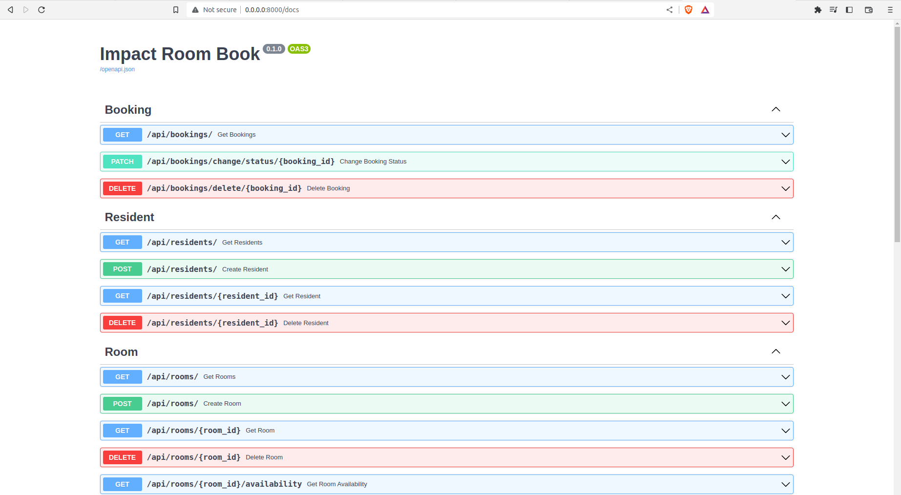

# Run the application as follows

Make sure you have `Docker` and `docker-compose` installed on your machine. If you do have them, after cloning the
repository change your directory to that cloned folder and run the following command on
your terminal.
```bash
docker-compose up -d --build
```
The above command starts-up two containers. To check their state run the below command in your terminal.
```bash
docker-compose ps
```
Now, open any browser and type `http://0.0.0.0:8000/docs`. You should see the following image





